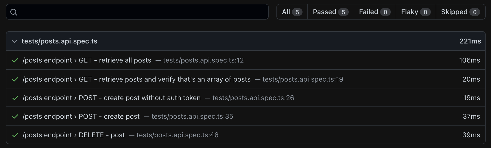

# playwright-api-testing-example


Read my article about [API testing with Playwright & odottaa](https://medium.com/).

Check out the [HTML report](https://elaichenkov.github.io/playwright-api-testing-example) that was published on GitHub pages.

## Usage

Clone the repository and run the following command:

```sh
npm install
```

## Run tests

```sh
npm test
```

Then, to open report run the following command:

```sh
npm run report
```

It will open default browser and open the HTML report



## Run server (optionally)

```sh
npm start
```

## Author

Yevhen Laichenkov

## License

[MIT](LICENSE)
